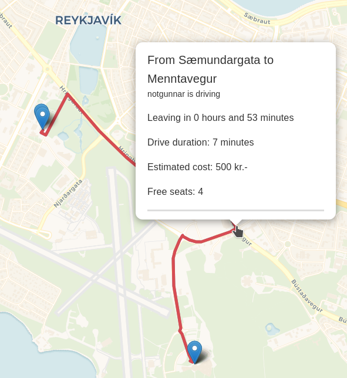

I wrote a ridesharing webapp to enable users to easily search for free rides and plan their carpool together. This was done for my Universities Software Project 1 class.

The backend is a REST API written in Java Spring. It uses PostgreSQL as the database and PostGIS to allow the storage of geospatial data. We get all the geo-data from the [Open Route Service](https://openrouteservice.org/) API, including geo-names, route distances, durations and more.

The frontend uses React and [LeafletJS](https://leafletjs.com/), and MaterialUI for UI components.

The app features a way to search for convinient rides that are departing from and to points close to the users search
